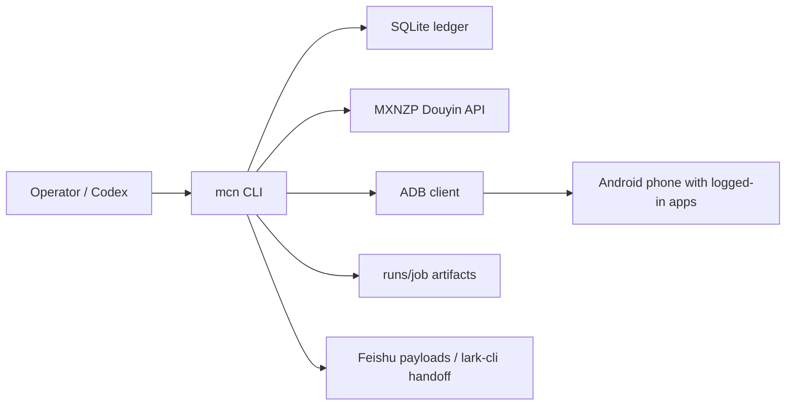

# Technical Spec

## Architecture

The system is a Python CLI package with no server process.

## Data Model

The minimal ledger includes:

- `ip_profiles`
- `content_packages`
- `publish_jobs`
- `android_devices`
- `app_accounts`
- `publish_run_logs`
- `tracking_snapshots`
- `ip_roles`
- `collection_tasks`
- `collection_task_roles`
- `collection_runs`
- `collection_candidates`
- `collected_materials`
- `douyin_authors`
- `douyin_author_videos`
- `material_role_matches`
- `material_creations`
- `mxnzp_call_logs`
- `mxnzp_call_cache`
- `material_understanding_logs`

JSON columns are used for evolving metadata. Stable publish state stays in explicit status columns.

Material collection separates three responsibilities:

- `collected_materials`: stores the source material itself. `role_id` is kept for compatibility and should be read as the collection/source role; new code should use `source_role_id` for that meaning.
- `douyin_authors`: stores source author profiles, keyed by Douyin `sec_uid`, with follower count, total favorited, signature, avatar, profile URL, and raw profile JSON.
- `douyin_author_videos`: stores known videos for an author. It starts with the source material video and can later be expanded through `user_post`.
- `material_role_matches`: stores many-to-many role-fit judgments. One material can be accepted or rejected for multiple IP roles, with separate scores and reasons.
- `material_creations`: stores role-specific rewrite usage. This is the source of truth for whether a specific IP role has already created a draft from a specific material.

## Operator Tools

DB Browser for SQLite 3.13.1+ is the preferred GUI for inspecting the local ledger at `data/mcn_ops.sqlite`.
It is an operator/development tool, not a Python runtime dependency. Use it to review high-volume text and JSON fields such as:

- `collected_materials.transcript_text`
- `collected_materials.raw_json`
- `collected_materials.source_package_json`
- `collection_candidates.raw_json`
- `mxnzp_call_cache.response_json`

## CLI

- `mcn init-db`
- `mcn adb doctor`
- `mcn adb devices`
- `mcn content create`
- `mcn collect catalog`
- `mcn collect mxnzp-call`
- `mcn collect role upsert/list/show/import/match-existing`
- `mcn collect task keyword/author/discover-authors/show/report/resume`
- `mcn collect run`
- `mcn collect understand`
- `mcn collect match`
- `mcn collect report`
- `mcn material list/show/promote`
- `mcn publish prepare`
- `mcn publish push-assets`
- `mcn publish run`
- `mcn publish verify`
- `mcn publish feishu-payload`
- `mcn report daily`

## ADB Publishing

The runner supports:

- asset push to `/sdcard/Download/codex-mcn-ops`
- app launch through package names
- screenshot capture through `adb exec-out screencap -p`
- UI XML capture through `uiautomator dump`
- safe stop before submit
- manual calibration checkpoints for app-version-specific flows

## Platform Adapters

Adapters define:

- platform key and display name
- Android package name
- platform content constraints
- ordered publish steps
- whether a step requires live publishing

V1 adapters are conservative. They validate and capture, then mark UI-specific actions as calibration checkpoints until tested on the target phone/app version.

## Material Collection

Collection is CLI-first and has no server process. MXNZP is used only for Douyin data acquisition. The CLI currently writes a local-rules material understanding draft; Codex/GPT can later overwrite or deepen that draft through the same promoted columns and JSON payload.

The high-level task layer is `mcn collect task ...`:

- `keyword`: collects enough materials for one topic. Completion is based on target material count, not one search run. It can continue through seed keywords, related keywords, role keywords, and saved-material `next_collection_keywords`.
- `author`: collects viral works from one source author. The default viral threshold is `like_floor=10000`, `sortType=1`, duration window `20-300` seconds, and existing materials are preserved.
- `discover-authors`: ranks source authors from `collected_materials`, `collection_candidates`, and `douyin_author_videos`, then reuses the author workflow.
- `show/report/resume`: reads `collection_tasks` and linked `collection_runs` to summarize saved materials, skipped candidates, source authors, understanding status, next recommendations, API calls, and cache hits.

Low-level `collect run`, `collect author expand`, and `collect author materialize` remain stable execution primitives. High-level tasks reuse them conceptually through a workflow module and link work with `collection_runs.task_id`.

The global default collection policy is:

- `viral_like_floor = 10000`
- `min_duration_seconds = 20`
- `max_duration_seconds = 300`
- `engagement_score = likes + collects * 3 + comments * 2 + shares * 4`
- existing materials are reused by `work_id`, then `source_url`, then `title+author`, and are not overwritten unless an explicit refresh flag is used

Before transcript extraction, search results pass through a prefilter:

- `min_duration_seconds`, default `20`
- `max_duration_seconds`, default `300`
- title/caption relevance against topic and role keywords
- weighted engagement ranking: likes + saves * 3 + comments * 2 + shares * 4
- dynamic pagination stop when enough qualified candidates exist or the latest page has no promising candidate

The CLI exposes duration overrides with `mcn collect run --min-duration-seconds` and `--max-duration-seconds`, and the same policy is available on high-level task commands.

The fixed material understanding JSON fields are `topic_summary`, `hook`, `core_claim`, `content_structure`, `key_points`, `content_type`, `oral_script_pattern`, `audience`, `emotion_trigger`, `risk_level`, `rewrite_angles`, `risk_notes`, `usable_quotes`, `recommended_platforms`, `role_fit_notes`, and `next_collection_keywords`.

`mcn collect understand` writes the local-rules material understanding draft and, unless `--skip-role-match` is used, evaluates the material against enabled IP roles and writes `material_role_matches`. High-level task reports treat `local-rules/material-understanding-rules-v2` as draft understanding, not final Codex understanding. Final deep understanding should be stored as `codex-agent/gpt-5-codex/success`. `mcn material promote --role-id ...` creates a `content_packages` draft and records role-specific usage in `material_creations`.
