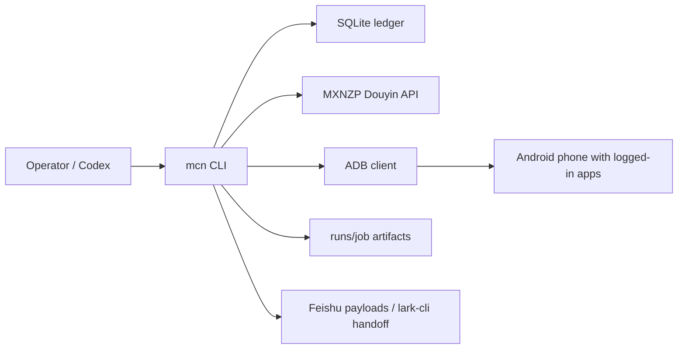

# Technical Spec

## Architecture

The system is a Python CLI package with no server process.


```mermaid
flowchart LR
  User["Operator / Codex"] --> CLI["mcn CLI"]
  CLI --> SQLite["SQLite ledger"]
  CLI --> MXNZP["MXNZP Douyin API"]
  CLI --> ADB["ADB client"]
  ADB --> Phone["Android phone with logged-in apps"]
  CLI --> Runs["runs/job artifacts"]
  CLI --> Feishu["Feishu payloads / lark-cli handoff"]
```

## Data Model

The minimal ledger includes:

- `content_packages`
- `publish_jobs`
- `publish_run_logs`
- `tracking_snapshots`
- `ip_roles`
- `ip_role_versions`
- `collection_tasks`
- `collection_task_roles`
- `collection_runs`
- `collection_candidates`
- `collected_materials`
- `douyin_authors`
- `douyin_author_videos`
- `material_role_matches`
- `material_creations`
- `creation_tasks`
- `creation_stage_runs`
- `creation_material_selections`
- `creation_drafts`
- `creation_delivery_packages`
- `creation_feedback_events`
- `creation_stage_feedback_events`
- `risk_term_observations`
- `creation_learning_updates`
- `mxnzp_call_logs`
- `mxnzp_call_cache`
- `material_understanding_logs`

JSON columns are used for evolving metadata. Stable publish state stays in explicit status columns.

Material collection separates three responsibilities:

- `ip_roles`: stores confirmed or draft IP role profiles. It includes positioning, audience, themes, forbidden directions, expression constraints, style anchors, search keywords, and a cached `persona_packet_json` for downstream selection and rewriting.
- `ip_role_versions`: stores snapshots created by `mcn collect role confirm`. Draft edits do not write versions; confirmed profile changes that touch key strategy fields move the role to `needs_reconfirm`.
- `collected_materials`: stores the source material itself. `role_id` is kept for compatibility and should be read as the collection/source role; new code should use `source_role_id` for that meaning.
- `douyin_authors`: stores source author profiles, keyed by Douyin `sec_uid`, with follower count, total favorited, signature, avatar, profile URL, and raw profile JSON.
- `douyin_author_videos`: stores known videos for an author. It starts with the source material video and can later be expanded through `user_post`.
- `material_role_matches`: stores many-to-many role-fit judgments. One material can be accepted or rejected for multiple IP roles, with separate scores and reasons.
- `material_creations`: stores role-specific rewrite usage. This is the source of truth for whether a specific IP role has already created a draft from a specific material.

Creation separates process state from final publish content:

- `creation_tasks`: one high-level rewrite task for a confirmed IP, topic, platform, goal, and target count.
- `creation_stage_runs`: versioned stage outputs for material selection, brief, draft, hook, risk cleanup, publish format, and delivery. Retry creates a new stage version and keeps the old one.
- `creation_material_selections`: material recall results for one task. It records selected and rejected material decisions, scores, and reasons.
- `creation_drafts`: draft artifacts from rewrite, hook enhancement, and risk cleanup stages.
- `creation_delivery_packages`: the five-part delivery structure and the linked `content_packages` row when publish formatting is generated.
- `creation_feedback_events`: lightweight manual feedback and platform notices after publishing.
- `creation_stage_feedback_events`: pre-publish stage feedback such as rejected drafts, retry reasons, and human review notes. These events feed learning proposals before content is published.
- `risk_term_observations`: high-risk replacements, edge-term observations, and word-level experiments.
- `creation_learning_updates`: proposed Markdown knowledge-pack updates. They stay `pending` until explicitly applied.

Creation tasks use `material_selection` to produce source analysis before rewriting. Source analysis extracts the original hook, viral reasoning, authority frame, keep/discard elements, and ASR corrections. `rewrite_draft` must read that analysis, the global creation playbook, the target IP persona packet, the IP-specific playbook, task requirements, and stage feedback. Douyin short oral drafts default to 250-350 Chinese characters unless the task or IP profile overrides the range.

IP role confirmation status:

- `draft`: editable, not valid for formal high-level collection tasks or creation.
- `agent_suggested`: imported or Codex-suggested profile waiting for human confirmation.
- `confirmed`: valid for formal workflows.
- `needs_reconfirm`: a previously confirmed profile changed in key fields and must be confirmed again.

`source_role_id` is only the role that started or sourced collection. It must not be used to decide whether a material fits exactly one IP. Use `material_role_matches` for role fit, and `material_creations` for whether a role has already used a material.

## Operator Tools

DB Browser for SQLite 3.13.1+ is the preferred GUI for inspecting the local ledger at `data/mcn_ops.sqlite`.
It is an operator/development tool, not a Python runtime dependency. Use it to review high-volume text and JSON fields such as:

- `collected_materials.transcript_text`
- `collected_materials.raw_json`
- `collected_materials.source_package_json`
- `collection_candidates.raw_json`
- `mxnzp_call_cache.response_json`

## CLI

- `mcn init-db`
- `mcn adb doctor`
- `mcn adb devices`
- `mcn content create`
- `mcn create task new/run/confirm/retry/report/export`
- `mcn create knowledge packet`
- `mcn create feedback add/analyze`
- `mcn create learning propose/apply`
- `mcn collect catalog`
- `mcn collect mxnzp-call`
- `mcn collect role upsert/list/show/import/export/confirm/packet/match-existing`
- `mcn collect task keyword/author/discover-authors/show/report/resume`
- `mcn collect run`
- `mcn collect understand`
- `mcn collect match`
- `mcn collect report`
- `mcn material list/show/promote`
- `mcn publish prepare`
- `mcn publish push-assets`
- `mcn publish run`
- `mcn publish verify`
- `mcn publish feishu-payload`
- `mcn report daily`

## ADB Publishing

The runner supports:

- asset push to `/sdcard/Download/codex-mcn-ops`
- app launch through package names
- screenshot capture through `adb exec-out screencap -p`
- UI XML capture through `uiautomator dump`
- safe stop before submit
- manual calibration checkpoints for app-version-specific flows

## Platform Adapters

Adapters define:

- platform key and display name
- Android package name
- platform content constraints
- ordered publish steps
- whether a step requires live publishing

V1 adapters are conservative. They validate and capture, then mark UI-specific actions as calibration checkpoints until tested on the target phone/app version.

## Material Collection

Collection is CLI-first and has no server process. MXNZP is used only for Douyin data acquisition. Every collection path should run material understanding by default because the promoted understanding columns and `material_understanding_json` are the searchable metadata used later for IP matching and rewrite selection.

The high-level task layer is `mcn collect task ...`:

- `keyword`: collects enough materials for one topic. Completion is based on target material count, not one search run. It can continue through seed keywords, related keywords, role keywords, and saved-material `next_collection_keywords`.
- `author`: collects viral works from one source author. The default viral threshold is `like_floor=10000`, `sortType=1`, duration window `20-300` seconds, and existing materials are preserved.
- `discover-authors`: ranks source authors from `collected_materials`, `collection_candidates`, and `douyin_author_videos`, then reuses the author workflow.
- `show/report/resume`: reads `collection_tasks` and linked `collection_runs` to summarize saved materials, skipped candidates, source authors, understanding status, next recommendations, API calls, and cache hits.

Low-level `collect run`, `collect author expand`, and `collect author materialize` remain stable execution primitives. High-level tasks reuse them conceptually through a workflow module and link work with `collection_runs.task_id`.

When a high-level keyword task is started with `--role-id` or `--role-name`, the role must be `confirmed` and must not require reconfirmation. Low-level diagnostic commands can still read draft roles, but JSON match output marks those rows with `not_confirmed`.

The default understanding identity is `codex-agent/gpt-5.5/success`. `local-rules/material-understanding-rules-v2` is an explicit fallback only, remains `draft_local_understanding`, and should not be treated as fully metadata-ready.

The global default collection policy is:

- `viral_like_floor = 10000`
- `min_duration_seconds = 20`
- `max_duration_seconds = 300`
- `engagement_score = likes + collects * 3 + comments * 2 + shares * 4`
- existing materials are reused by `work_id`, then `source_url`, then `title+author`, and are not overwritten unless an explicit refresh flag is used

Before transcript extraction, search results pass through a prefilter:

- `min_duration_seconds`, default `20`
- `max_duration_seconds`, default `300`
- title/caption relevance against topic and role keywords
- weighted engagement ranking: likes + saves * 3 + comments * 2 + shares * 4
- dynamic pagination stop when enough qualified candidates exist or the latest page has no promising candidate

The CLI exposes duration overrides with `mcn collect run --min-duration-seconds` and `--max-duration-seconds`, and the same policy is available on high-level task commands.

After transcript extraction, every candidate passes a formal material eligibility gate before it can become a usable `collected_materials` row and before material understanding runs.

The gate is intentionally stricter than search prefiltering:

- `collection_candidates` can keep broad search hits for audit and later review.
- `collected_materials.status='collected'` means the material has a usable transcript and fits knowledge-sharing oral-script collection.
- Candidates with no transcript, ritual-action scripts, emotional interaction scripts, non-knowledge scenes, or weak knowledge core are skipped or marked with non-usable statuses such as `eligibility_rejected` or `missing_transcript`.
- Material understanding must not be generated for newly rejected candidates. Existing rejected rows can keep historical JSON for audit, but downstream list, match, and promote flows should treat only `status='collected'` as reusable.

Eligibility metadata is promoted into explicit columns on `collected_materials`: `material_eligibility_json`, `eligibility_status`, `eligibility_provider`, `eligibility_version`, `eligibility_reason_json`, `content_form`, `knowledge_core_score`, `oral_script_fit_score`, `ip_fit_score`, and `reject_reason`.

Hard-reject examples include concrete ritual actions such as water/spit/breathing/chanting operations, obvious non-knowledge scenes such as parenting/pet/plot interaction, and missing or too-short transcripts. A single Buddhist-color term is not by itself a hard rejection; it is recorded as `content_form='佛教色彩'` or risk context so IP-role matching and rewriting can decide whether to translate it into Daoist/guoxue language.

The fixed material understanding JSON fields are `topic_summary`, `hook`, `core_claim`, `content_structure`, `key_points`, `content_type`, `oral_script_pattern`, `audience`, `emotion_trigger`, `risk_level`, `rewrite_angles`, `risk_notes`, `usable_quotes`, `recommended_platforms`, `role_fit_notes`, and `next_collection_keywords`.

`mcn collect understand` writes or refreshes material understanding and, unless `--skip-role-match` is used, evaluates the material against enabled IP roles and writes `material_role_matches`. High-level task reports expose `metadata_ready_count`, `draft_local_count`, and pending understanding counts so collection output can be audited before二创. `mcn material promote --role-id ...` creates a `content_packages` draft and records role-specific usage in `material_creations`.

## Creation Workflow

The high-level creation entry is `mcn create task ...`. It is separate from low-level `mcn material promote`: `promote` can still create a quick content package from one material, while `create task` records the full rewrite process and feedback learning trail.

Formal creation requires a confirmed IP role:

```bash
mcn create task new \
  --role-id role_xxxxxxxxxxxx \
  --topic 财运 \
  --goal "为思丞说生成一条知识型五段式口播" \
  --platform douyin \
  --target-count 3
```

Stages are fixed and should be confirmed in order:

1. `material_selection`: recalls only `collected_materials.status='collected'` and `eligibility_status='accepted'`.
2. `creation_brief`: locks IP, topic, audience, main claim, retained material points, and avoided directions.
3. `rewrite_draft`: generates a complete oral script draft.
4. `hook_enhancement`: keeps or rebuilds the opening and records hook candidates.
5. `risk_cleanup`: replaces high-risk terms and records edge terms for observation.
6. `publish_format`: creates the five-part publish package and the linked `content_packages` draft.
7. `delivery`: exports a human-readable Markdown delivery package.

The default formal identity is `codex-agent/gpt-5.5`. Rule-based output is only a fallback/test mode and must be marked as draft-level creation, not final Codex work.

Material reuse is IP-specific. By default, materials already present in `material_creations` for the same role are not recommended again. Use `--allow-reuse-material` only when intentionally revisiting a source material.

Creation context is assembled from:

- the role `persona_packet_json`
- `knowledge/creation/global-rewrite-playbook.md`
- `knowledge/creation/global-risk-lexicon.md`
- `knowledge/creation/hook-playbook.md`
- `knowledge/ip/<role_slug>/creation-playbook.md`
- `knowledge/ip/<role_slug>/feedback-learnings.md`
- `knowledge/ip/<role_slug>/recent-creation-memory.md`
- promoted material understanding fields for selected materials
- the current task brief

The context packet does not include full transcripts by default. Full transcript text is loaded only when a stage explicitly asks for it.

Feedback is intentionally lightweight. `mcn create feedback add` records platform metrics, platform notices, and human notes. `mcn create learning propose` turns those events and risk observations into Markdown update proposals. `mcn create learning apply` is the only command that mutates the knowledge pack, preventing one bad feedback sample from automatically polluting future creation prompts.
